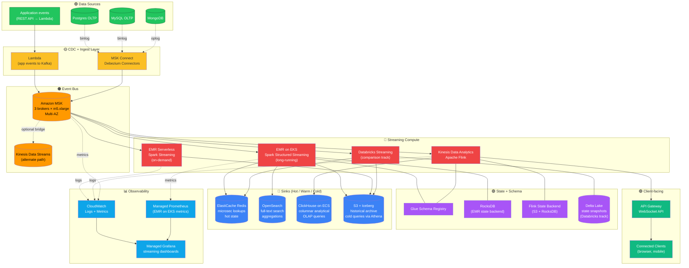
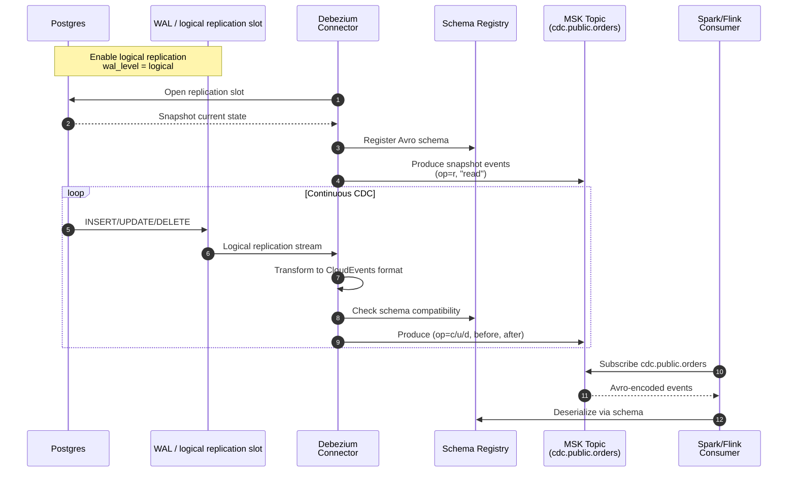
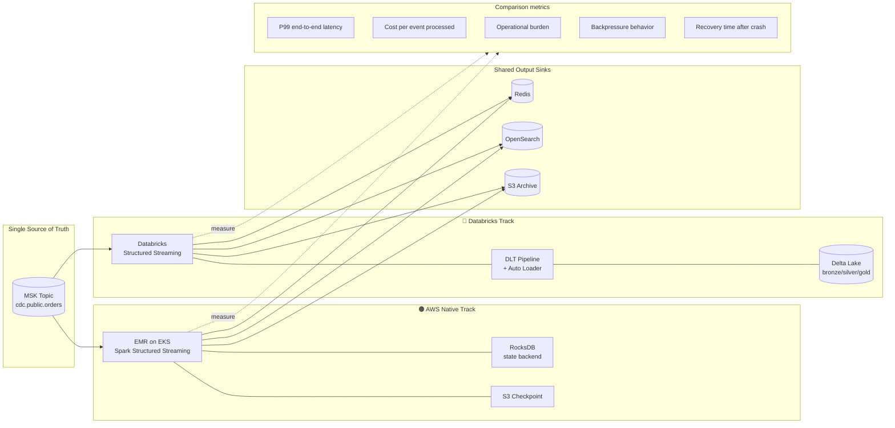
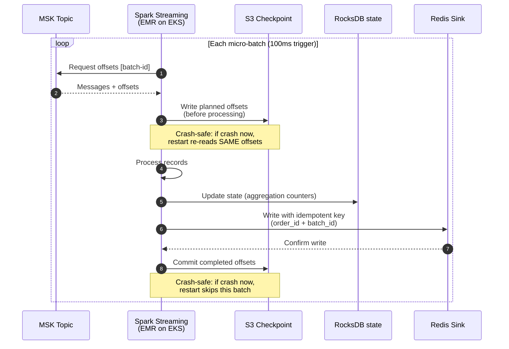
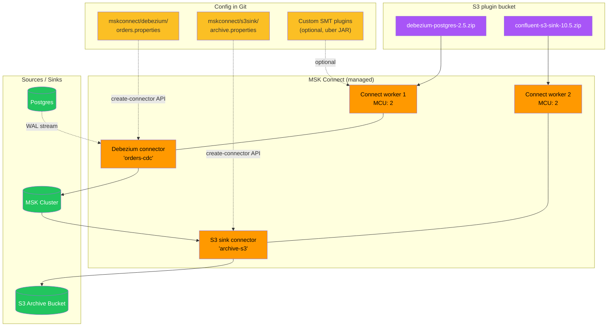
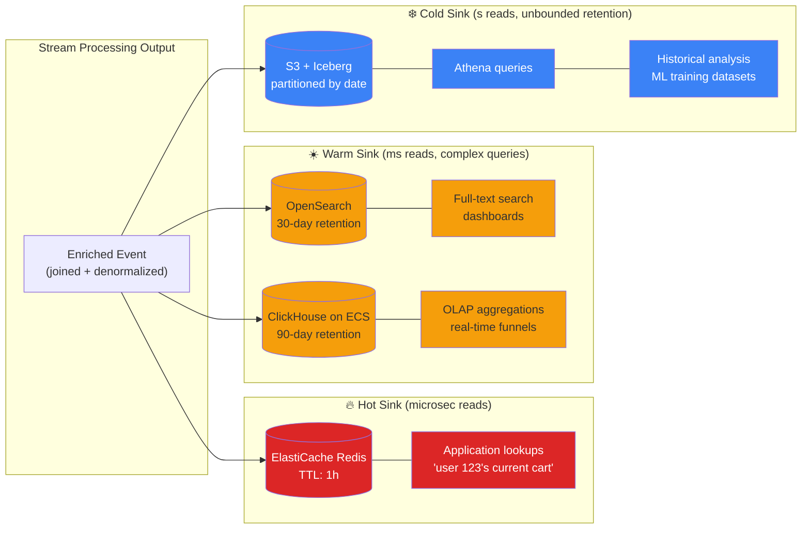
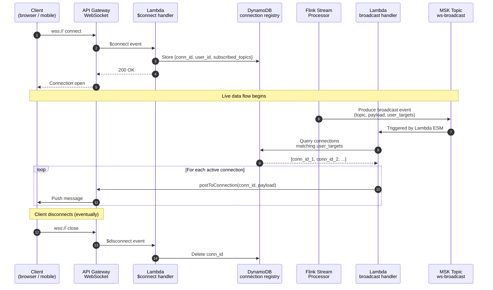
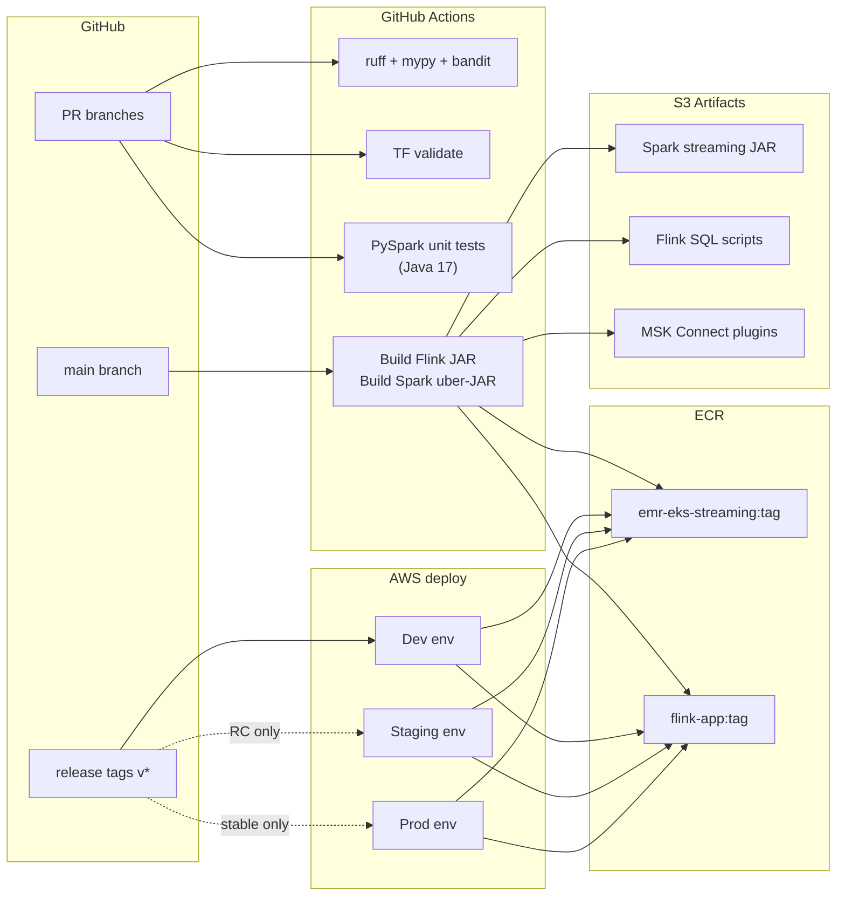

# AWS MSK + EMR Streaming Platform

> Production-grade real-time data platform built on **AWS MSK** (Managed Kafka) as the backbone, with **MSK Connect / Debezium** for database CDC, **EMR on EKS** + **EMR Serverless** running Spark Structured Streaming, **Kinesis Data Analytics for Apache Flink** for SQL-native streaming, and a hot/warm/cold sink fan-out (ElastiCache Redis / OpenSearch / ClickHouse / S3). Includes a parallel **Databricks Streaming** comparison path so teams can evaluate both runtimes on identical workloads.

[](https://github.com/sushmakl95/aws-msk-emr-streaming-platform/actions/workflows/ci.yml)
[](https://www.python.org/)
[](https://spark.apache.org/)
[](https://flink.apache.org/)
[](https://aws.amazon.com/)
[](https://www.databricks.com/)
[](https://www.terraform.io/)
[](LICENSE)

---

## Author

**Sushma K L** — Senior Data Engineer
📍 Bengaluru, India
💼 [LinkedIn](https://www.linkedin.com/in/sushmakl1995/) • 🐙 [GitHub](https://github.com/sushmakl95) • ✉️ sushmakl95@gmail.com

---

## What this platform does

You have an operational database (Postgres, MySQL, or MongoDB) and need:
1. **Sub-second propagation** of every row change to downstream systems
2. **Multiple sinks** with different access patterns — hot lookups, full-text search, columnar analytics, cold archive
3. **At-least-once guarantees** with **end-to-end backpressure handling**
4. **Choice of processing runtime** — Spark Structured Streaming, Flink SQL, or both
5. **Real-time push to clients** via WebSocket

This repo is the opinionated AWS-native implementation of all five, with a `Databricks Streaming` track showing the same pipeline on that runtime for TCO/operational comparison.

## Comparison at a glance

| Capability | AWS-native (this platform) | Databricks alternative |
|---|---|---|
| Event bus | Amazon MSK | Databricks managed Kafka (AWS MSK under the hood) |
| Streaming compute | EMR on EKS + EMR Serverless + Flink | Databricks Structured Streaming |
| State store | RocksDB on EMR / Flink state backend | Delta Lake (bronze) + Databricks state store |
| Exactly-once | Kafka transactions + Flink 2PC + Spark checkpoints | DLT + Delta ACID |
| CDC ingest | MSK Connect + Debezium | Delta Lake CDC + Auto Loader |
| Monitoring | CloudWatch + Grafana | Databricks observability |
| Monthly cost (baseline) | ~$1,800/month | ~$2,400/month |

Both tracks produce identical output semantics; choose based on your team's skills + existing tooling.

---

## System Architecture

### High-level architecture



### CDC ingestion flow (Postgres → MSK)



### Dual-runtime streaming comparison



### Exactly-once semantics — Spark Structured Streaming path



### MSK Connect deployment model



### Hot / Warm / Cold sink fan-out



### WebSocket push architecture



### Deployment + CI/CD topology



---

## Repository Structure

```
aws-msk-emr-streaming-platform/
├── .github/workflows/          # CI: lint + TF validate + build + unit tests
├── src/
│   ├── streaming/
│   │   ├── core/               # StreamEvent, Checkpoint, Watermark types
│   │   ├── sources/            # Kafka, Kinesis source builders
│   │   ├── sinks/              # Redis, OpenSearch, ClickHouse, S3 sinks
│   │   ├── transforms/         # Windowing, joins, enrichment UDFs
│   │   ├── jobs/               # Spark Structured Streaming jobs
│   │   ├── state/              # State store helpers, RocksDB config
│   │   ├── orchestration/      # EMR job submission + lifecycle
│   │   └── utils/              # Logging, metrics, secrets
│   ├── flink/                  # Flink SQL + DataStream jobs (Python + SQL)
│   └── lambdas/                # WebSocket handlers, broadcast Lambda
├── mskconnect/                 # Debezium + S3 sink connector configs
├── notebooks/                  # Databricks Streaming comparison notebooks
├── infra/terraform/
│   ├── modules/                # 17 modules
│   └── envs/                   # dev/staging/prod
├── dashboards/                 # Grafana + CloudWatch JSON
├── scripts/                    # Deploy, submit jobs, scale brokers
├── tests/                      # Unit + integration
├── config/                     # Topic configs, sink configs
└── docs/
    ├── ARCHITECTURE.md
    ├── EXACTLY_ONCE.md
    ├── BACKPRESSURE.md
    ├── RUNTIME_COMPARISON.md
    ├── MSK_OPERATIONS.md
    ├── LOCAL_DEVELOPMENT.md
    ├── COST_ANALYSIS.md
    └── RUNBOOK.md
```

## Quick Start (Local Dev)

```bash
git clone https://github.com/sushmakl95/aws-msk-emr-streaming-platform.git
cd aws-msk-emr-streaming-platform
make install-dev

# Start local Kafka + Postgres + Debezium stack
make compose-up

# Produce some test events
make demo-seed-data

# Run a Spark Streaming job locally
make demo-spark-job

# Run a Flink SQL job locally
make demo-flink-job
```

## ⚠️ Cloud Cost Warning

Full production deployment costs approximately **$1,800/month** at moderate throughput (10k events/sec baseline). See [docs/COST_ANALYSIS.md](docs/COST_ANALYSIS.md). For evaluation, use the local Docker Compose stack (free).

## Resume Alignment

Directly maps to these responsibilities from my roles:

- **Talent 500**: "Designed and delivered real-time CDC ingestion using Kafka + Debezium + AWS EMR for cross-platform data replication"
- **Publicis Sapient / Goldman Sachs**: "Engineered and maintained Databricks-based lakehouse pipelines with Spark Structured Streaming"
- **Current (JLP)**: "Real-time clickstream processing with Adobe Analytics feed integration"

## License

MIT — see [LICENSE](LICENSE).
